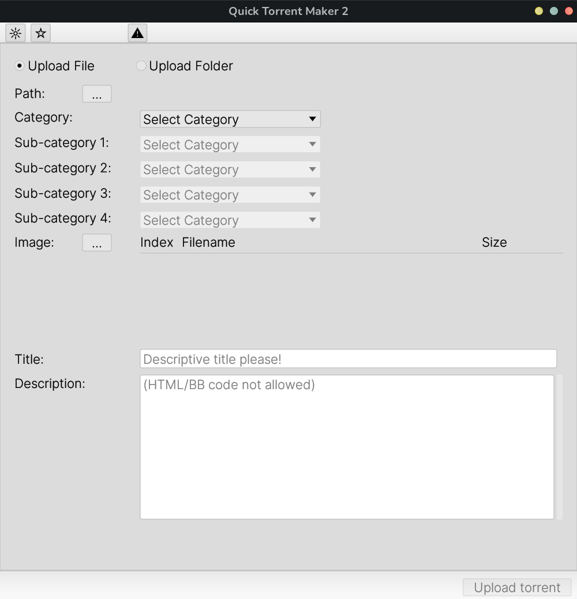

# Quick Torrent Maker 2 (QTM2)
QTM2 is a cross-platform application that aims to integrate creating and uploading torrents to [GayTorrent](https://www.gaytor.rent/), in order to produce more quality and descriptive contents easier from most modern operating system platforms (Windows / macOS / Linux). It is written in **Rust**, a fast and memory-safe general purpose programming language, using egui and other library crates as well as fonts that may be found in the [Cargo.toml](Cargo.toml) and [LICENSE.md](LICENSE.md) files.



This is a project that is undergoing active development, so bugs are possible. Please report any [here](#TODO) with detailed descriptions of your system configuration and steps to reproduce the bug. You may also suggest new features [here](#TODO) to be added to the roadmap section below. 

Please observe and follow all GT [site rules](https://www.gaytor.rent/rules.php) and refer to the [FAQs](https://www.gaytor.rent/faq.php) and [help desk](https://www.gaytor.rent/helpdesk.php) for other queries/issues. Please act responsibly and respect other members of the community.

Please also note that the binary and its data structures are referred to as `qtm` in the source code only for brevity; it is not derived from nor associated with the source code or the authors/contributors of the original QTM at all; however, the UI and many functionalities are built upon its design.


## Roadmap:

### Completed:
- [x] Top/bottom UI panels
- [x] TOML configuration file (de)serialisation
- [x] Tracing

### Priority:
- [ ] Networking
- [ ] Password prompt
- [ ] Torrent file (de)serialisation
- [ ] uTorrent/qBittorrent integration

### Future:
- [ ] install.sh shell
- [ ] CI testing/package generation
- [ ] Image preview
- [ ] Video thumbnail generator
- [ ] CLI support
- [ ] UI Customisation


## Installation
### Install dependencies (Linux ONLY)
note: dependency installation _only_ tested on Ubuntu
#### Debian/Ubuntu
```
sudo apt-get install libatk1.0-0 libgtk-3-dev
```
#### Arch Linux
```
sudo pacman -S atk-git gtk3
```
#### Fedora
```
sudo dnf install atk gtk3-devel
```

### Build from source
1. Follow the instruction [here](https://www.rust-lang.org/tools/install) to install the Rust toolchain, including `cargo`.
2. Execute `cargo install --git https://github.com/fieryfurry/qtm2` in your terminal

### Prebuilt binaries
Upcoming...

## License
QTM2 is licensed under the [BSD-2-Clause Plus Patent License](https://spdx.org/licenses/BSD-2-Clause-Patent.html). 

This license is designed to provide: a) a simple permissive license; b) that is compatible with the GNU General Public License (GPL), version 2; and c) which also has an express patent grant included. 
